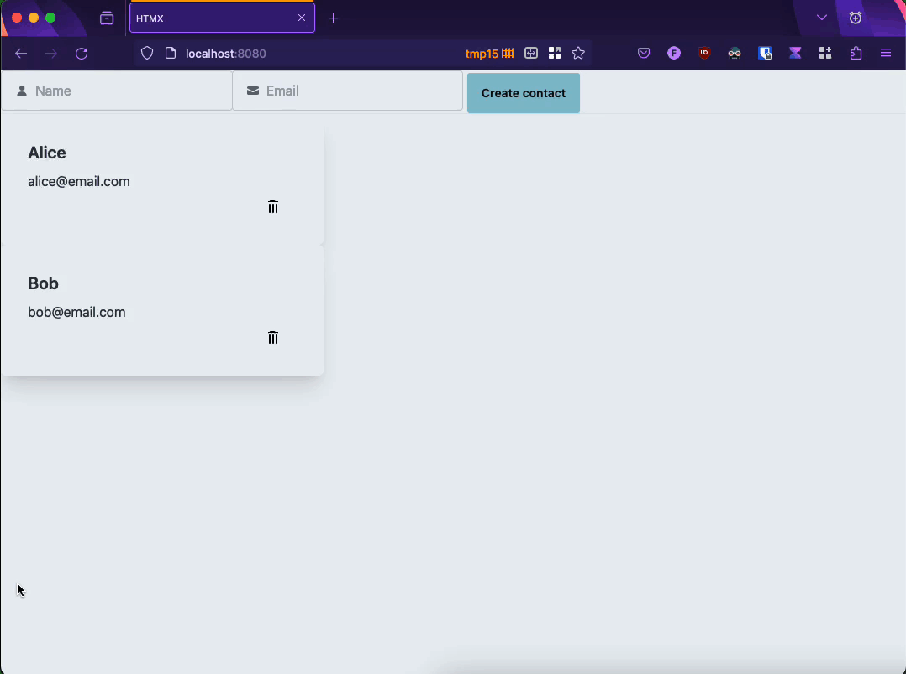

# htmx-contacts

This is an experiment where I built a simple contact list application using [HTMX](https://htmx.org/) and Go with templates.



## Why Go and HTMX?

Together, Go and HTMX provide a great developer experience for building web applications that are fast, responsive, and easy to maintain.

- Go's templating engine is simple and easy to use, and it allows you to build reusable components that can be shared across multiple pages, enabling server side rendering.

- HTMX plugs well into Go's templating engine, allowing you to build dynamic web applications without writing a lot of JavaScript. It allows you to build web applications that are fast, responsive, and easy to maintain.

## Tech Stack

- [Go](https://go.dev/)
- [HTMX](https://htmx.org/)
- [DaisyUI](https://daisyui.com/)

## Running the application

To run the application, you need to have Go installed on your machine. You can download Go from [here](https://golang.org/dl/).

After installing Go, you can run the application by running the following command:

```bash
make run
```

This will start the application on port 8080. You can access the application by visiting [http://localhost:8080](http://localhost:8080).

## Development

### Prerequisites

Install `air` by running the following command:

```bash
go install github.com/cosmtrek/air@latest
```

### Running the development server

To start the development server, you can run the following command:

```bash
make dev
```

This will start the development server on port 8080 and rebuild it automatically as air detects changes to the code. You can access the application by visiting [http://localhost:8080](http://localhost:8080).
